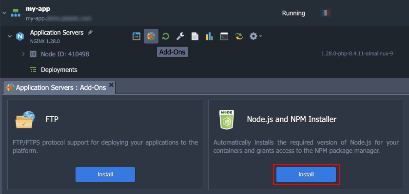
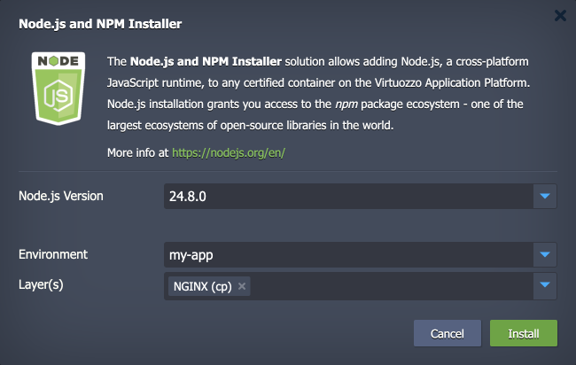
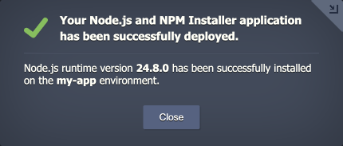
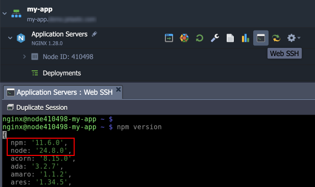
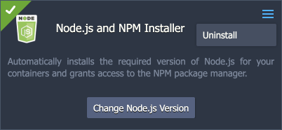
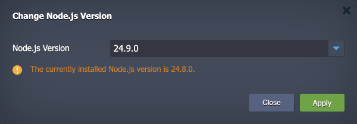
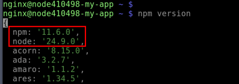

 

# Node.js and NPM Installer Add-On

The **Node.js and NPM Installer** solution allows adding [Node.js](https://nodejs.org/en/), a cross-platform JavaScript runtime, into any certified container on the Virtuozzo Application Platform (VAP). Node.js installation grants you access to the ***npm*** package ecosystem - one of the largest ecosystems of the open-source libraries in the world. The add-on helps with the implementation of some complex CI/CD scenarios. For example, Node.js and NPM can be needed for operations with static content or for building and running of some WordPress (and other web application) modules.

The installation can be performed on any certified container (except Node.js ones as the functionality is already available there) and allows choosing the preferred software version (from the list of Node.js stacks available on the platform).

## Add-On Installation

To instal Node.js and NPM package manager for your VAP containers, you need to be registered at one of the [Virtuozzo Public Cloud Providers](https://www.virtuozzo.com/application-platform-partners/).

1\. Log in to your Virtuozzo Application Platform dashboard. Then hover over the required container and click the **Add-Ons** icon.

> Alternatively, you can deploy this solution from the [Marketplace](https://www.virtuozzo.com/application-platform-docs/marketplace/) or [import](https://www.virtuozzo.com/application-platform-docs/environment-import/) a manifest file from this repository.

2\. In the opened installation window, specify the following details:

- **Node.js Version** – choose the preferred stack version from the drop-down list
- **Environment** – select the target environment for the add-on installation (automatically selected if accessed via the *Add-Ons* icon)
- **Layer(s)** - pick the environment [layers](https://www.virtuozzo.com/application-platform-docs/concept-and-terminology/#layer) where the add-on should be installed (you can choose multiple ones)

> **Note:** The list of available Node.js versions is automatically updated based on the latest versions supported by the Virtuozzo Application Platform. The **16.20.2** version is kept to support legacy containers (based on the CentOS 7 OS template) and cannot be installed on modern containers (based on the AlmaLinux 9 OS template).

3\. Click **Install** to proceed and wait a minute for the solution to be deployed.

4\. To check if Node.js and NPM are available for your containers, you can connect via SSH (e.g., using [Web SSH](https://www.virtuozzo.com/application-platform-docs/web-ssh-client/)) and run the `npm version` command:

## Manage Add-On

Once installed, the ***Node.js and NPM Installer*** add-on can be found under the appropriate node’s **Add-Ons** section. Here, you can **Change Node.js Version** and **Uninstall** the add-on.

When changing the version, just pick a new one from the list, click **Apply**, and confirm the action via pop-up.

Once the add-on is re-installed, you can check the new Node.js and NPM versions.

